Eye-Tracking Workshop
========================================================
author: Julia and Divya
date: 02.09.2020
autosize: true

For more details on authoring R presentations please visit <https://support.rstudio.com/hc/en-us/articles/200486468>.


The basic idea: What does eye-tracking do?
========================================================


Eye-tracking relies on the **eye-mind hypothesis/assumption**:  
What you look at is what you think about

And furthermore:  
Time is related to processing effort  
Delays hint at processing difficulties

Using eye-tracking, we can track participants' subconscious processes.  
It's an **on-line** (as opposed to off-line) measure of **processing difficulty** with a high temporal resolution.


The basic idea: What does eye-tracking do?
========================================================
type: prompt
incremental: true

Complete this sentence:  
*The old man...*

Now read this sentence:  
*The old man the boat.*

What happened when you read this sentence, and why?  
Which word(s) did you get stuck on?

Typically, people interpret *old* as an adjective which refers to *man* as a noun. But here, *old* is a noun and *man* a verb instead, so in **garden-path sentences** like these, readers need to update their interpretations.  
In this example, we'd typically see a delay on *the* because that's when readers realise their interpretation can't be correct.


How do eye-trackers work?
========================================================

They use a **camera** (left) and an **infrared light** (right)

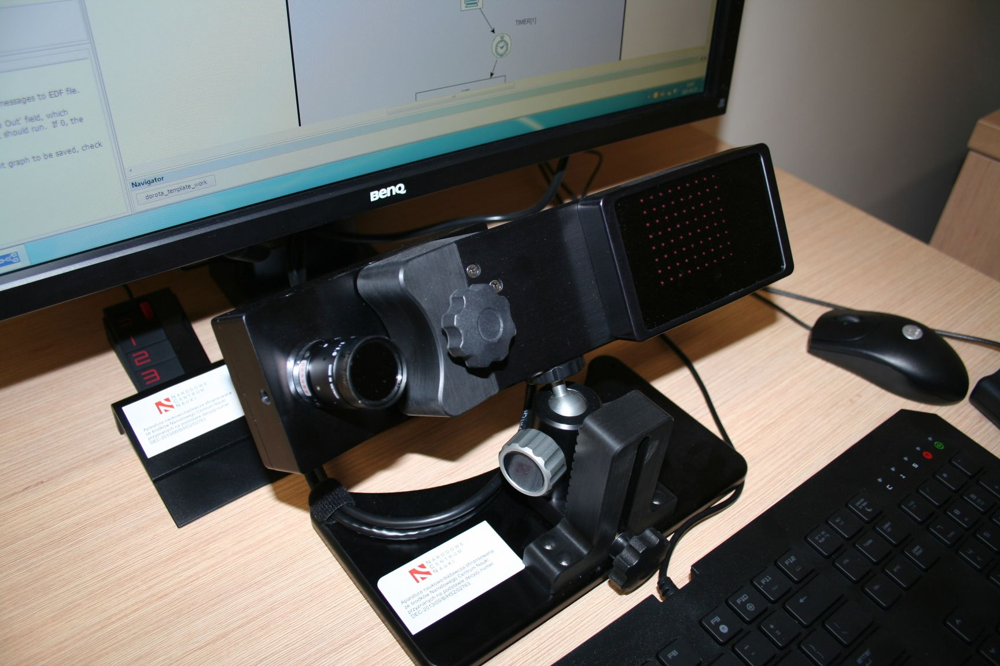

***

...to track the **pupil** (green) and the **corneal reflection** (red)  
  
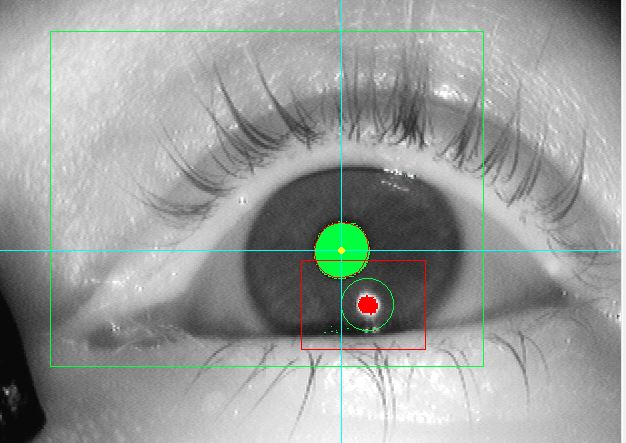


How do eye-trackers work?
========================================================
The difference between the **center of the pupil** and the **corneal reflection** is used to calculate the position of the gaze.
***
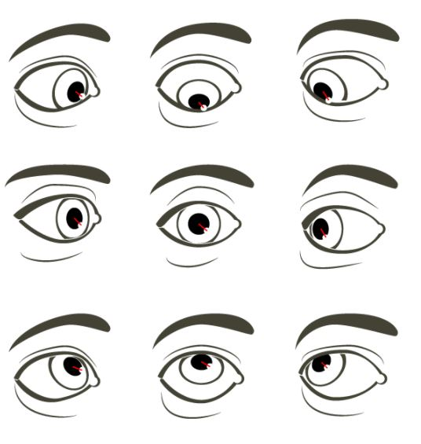


Eye-tracking systems
========================================================

**Three types of systems:**

- workstation/desktop
- mobile solutions
- eye-tracking glasses

***

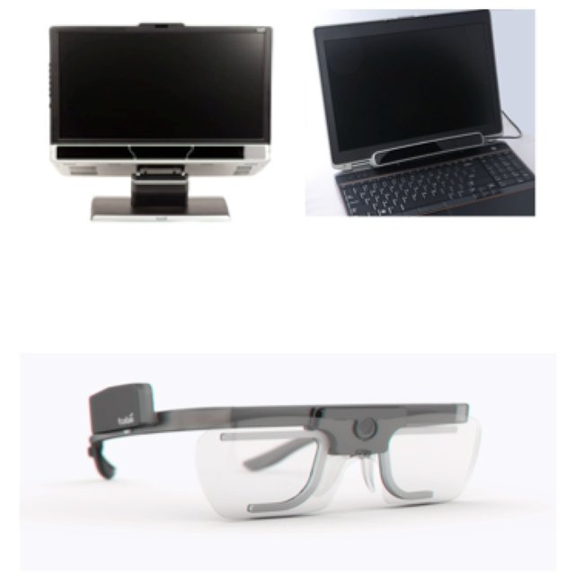


Eye-tracking systems: Workstation/desktop
========================================================


Eye-tracking systems: Workstation/desktop
========================================================

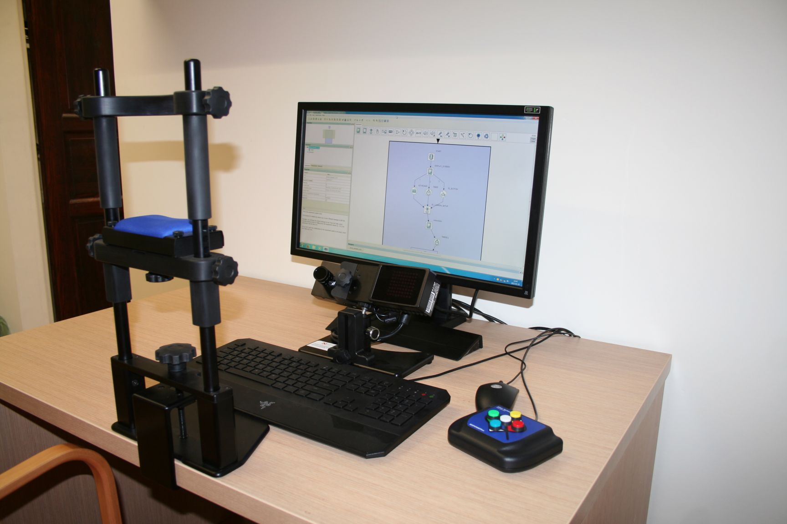


Eye-tracking systems: Glasses
========================================================

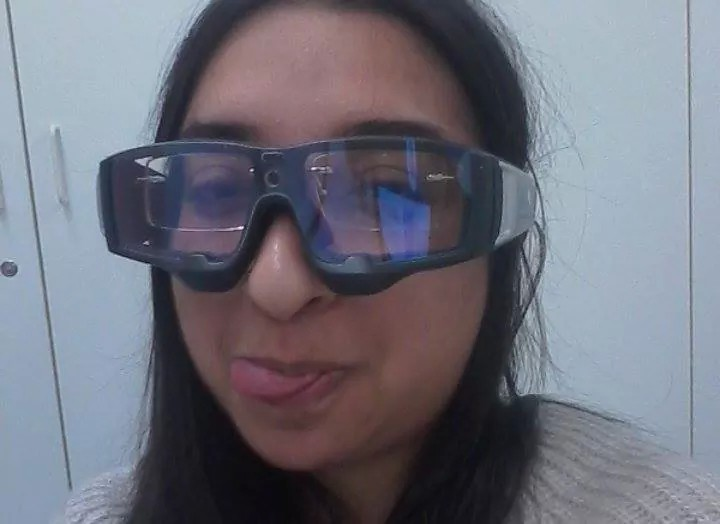


Considerations
========================================================

**Practicality**
- desktop setups: participants have to travel to the lab
- mobile setups: can be done anywhere

**Naturalness**
- reading in a desktop setups is very different from how you would usually read
- mobile setups feel more natural

***

**Sampling rate**  
- measured in Hz (times per second)  
- = how many pictures the camera takes per second  
- from 25-30 Hz to 1000 Hz or more, depending on the device
- for reading experiments: at least 1000 Hz recommended
- desktop setups tend to have the highest sampling rate


Where can you use eye-tracking?
========================================================
**It's very versatile!**

- Reading (music), also in literary studies
- Cognitive tasks
- Free viewing, scene perception, visual search
- Communication between users and computer systems

***

**Applicability in**
- Linguistics
- Clinical psychology
- Consumer behaviour
- Expertise and training


Typical eye-tracking procedure
========================================================
**... in a reading experiment**

Calibration and validation [(video)](https://youtu.be/FPkRxzSE0bk?t=52)

Once successful, a loop of:
- text
- question
- feedback
- drift correct  

...while managing a long list of potential problems (contact lenses, glasses, mascara or long lashes, small eyes, wet eyes, downward-facing lashes, sunlight, electromagnetic noise in the lab...)


Typical eye-tracking procedure
========================================================

**Experimenter's view:**

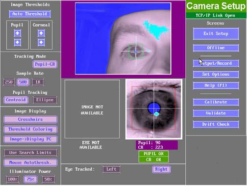

...and an example of how our eyes move while we read [(video)](https://www.youtube.com/watch?v=j8-VYcYkgqY)


Let's look at some scan-paths
========================================================

#I think we should show some examples first before we get technical, so I moved this slide up
#I will have to switch to show videos here

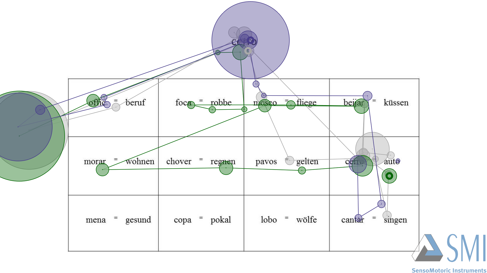


What kind of data can you get from eye-trackers?
========================================================
type: prompt
incremental: true

- Fixations: eyes stop, don't move (number of fixations and fixation *duration* commonly analysed)
- Saccades: movements from fixation to fixation
- Microsaccades
- Regressions: backwards movements  
  - short regressions likely due to overshooting
  - long(er) regressions: processing difficulty
- Pupil dilation: can indicate mental load
- Blinks

What parameters could we get from these? How could they compliment each other?

Word of caution: These are not as categorical as may seem.


What does eye-tracking data look like?
========================================================

An example with reading data
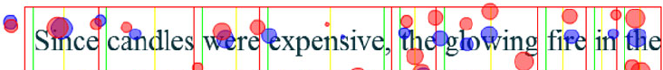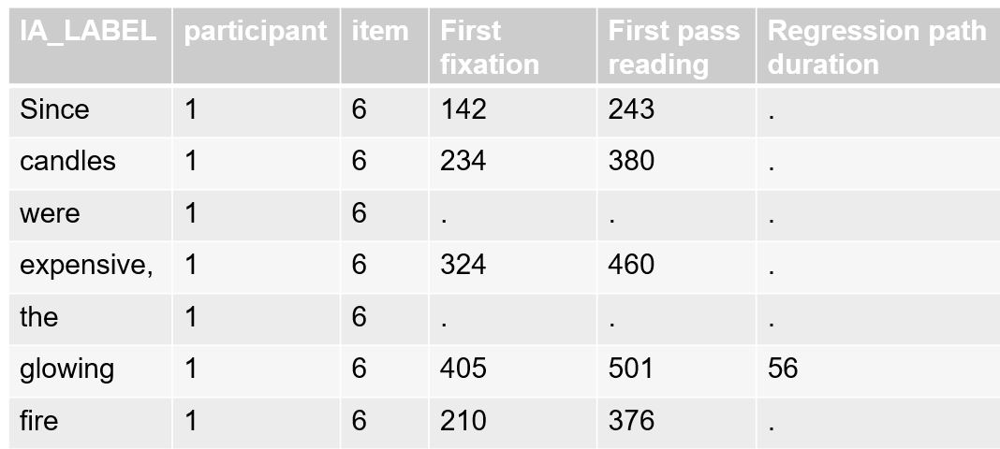

What does eye-tracking data look like?
========================================================
**An example of a reading experiment investigating gender stereotypes**

Congruent condition:
The *doctor* enjoyed *his* day off.
The *nurse* liked *her* new shoes.

Incongruent condition:
The *doctor* enjoyed *her* day off.
The *nurse* liked *his* new shoes.

Here, we're interested in how people behave when they get to the pronouns *his* and *her*, so the areas/regions of interest (AOIs/IAs/ROIs) are those pronouns.  
Often, the AOIs are determined by the design. There are, however, also procedures to find AOIs.


What does eye-tracking data look like?
========================================================

After exporting the data, you'll typically be left with a lot of variables. For example, here are the column names of an exported data file from an EyeLink 1000 eye-tracker:

```
  [1] "RECORDING_SESSION_LABEL"              
  [2] "TRIAL_INDEX"                          
  [3] "DATA_FILE"                            
  [4] "EYE_USED"                             
  [5] "IA_AREA"                              
  [6] "IA_AVERAGE_FIX_PUPIL_SIZE"            
  [7] "IA_BOTTOM"                            
  [8] "IA_DWELL_TIME"                        
  [9] "IA_DWELL_TIME"                        
 [10] "IA_DYNAMIC"                           
 [11] "IA_END_TIME"                          
 [12] "IA_FIRST_FIXATION_DURATION"           
 [13] "IA_FIRST_FIXATION_INDEX"              
 [14] "IA_FIRST_FIXATION_RUN_INDEX"          
 [15] "IA_FIRST_FIXATION_TIME"               
 [16] "IA_FIRST_FIXATION_VISITED_IA_COUNT"   
 [17] "IA_FIRST_FIXATION_X"                  
 [18] "IA_FIRST_FIXATION_Y"                  
 [19] "IA_FIRST_FIX_PROGRESSIVE"             
 [20] "IA_FIRST_RUN_DWELL_TIME"              
 [21] "IA_FIRST_RUN_END_TIME"                
 [22] "IA_FIRST_RUN_FIXATION_COUNT"          
 [23] "IA_FIRST_RUN_START_TIME"              
 [24] "IA_FIRST_SACCADE_AMPLITUDE"           
 [25] "IA_FIRST_SACCADE_ANGLE"               
 [26] "IA_FIRST_SACCADE_END_TIME"            
 [27] "IA_FIRST_SACCADE_INDEX"               
 [28] "IA_FIRST_SACCADE_START_TIME"          
 [29] "IA_FIXATION_COUNT"                    
 [30] "IA_FSA_COUNT_1"                       
 [31] "IA_FSA_COUNT_2"                       
 [32] "IA_FSA_COUNT_3"                       
 [33] "IA_FSA_COUNT_4"                       
 [34] "IA_FSA_COUNT_5"                       
 [35] "IA_FSA_COUNT_6"                       
 [36] "IA_FSA_COUNT_7"                       
 [37] "IA_FSA_COUNT_8"                       
 [38] "IA_FSA_COUNT_9"                       
 [39] "IA_FSA_COUNT_10"                      
 [40] "IA_FSA_COUNT_11"                      
 [41] "IA_FSA_COUNT_12"                      
 [42] "IA_FSA_COUNT_13"                      
 [43] "IA_FSA_COUNT_14"                      
 [44] "IA_FSA_COUNT_15"                      
 [45] "IA_FSA_COUNT_16"                      
 [46] "IA_FSA_COUNT_17"                      
 [47] "IA_FSA_COUNT_18"                      
 [48] "IA_FSA_COUNT_19"                      
 [49] "IA_FSA_COUNT_20"                      
 [50] "IA_FSA_COUNT_21"                      
 [51] "IA_FSA_COUNT_22"                      
 [52] "IA_FSA_COUNT_23"                      
 [53] "IA_FSA_COUNT_24"                      
 [54] "A_FSA_COUNT_25"                       
 [55] "IA_FSA_COUNT_26"                      
 [56] "IA_FSA_COUNT_27"                      
 [57] "IA_FSA_COUNT_28"                      
 [58] "IA_FSA_COUNT_29"                      
 [59] "IA_FSA_COUNT_30"                      
 [60] "IA_FSA_COUNT_31"                      
 [61] "IA_FSA_COUNT_32"                      
 [62] "IA_FSA_COUNT_33"                      
 [63] "IA_FSA_COUNT_34"                      
 [64] "IA_FSA_COUNT_36"                      
 [65] "IA_FSA_COUNT_37"                      
 [66] "IA_FSA_COUNT_38"                      
 [67] "IA_FSA_COUNT_39"                      
 [68] "IA_FSA_DURATION_1"                    
 [69] "IA_FSA_DURATION_2"                    
 [70] "IA_FSA_DURATION_3"                    
 [71] "IA_FSA_DURATION_4"                    
 [72] "IA_FSA_DURATION_5"                    
 [73] "IA_FSA_DURATION_6"                    
 [74] "IA_FSA_DURATION_7"                    
 [75] "IA_FSA_DURATION_8"                    
 [76] "IA_FSA_DURATION_9"                    
 [77] "IA_FSA_DURATION_10"                   
 [78] "IA_FSA_DURATION_11"                   
 [79] "IA_FSA_DURATION_12"                   
 [80] "IA_FSA_DURATION_13"                   
 [81] "IA_FSA_DURATION_14"                   
 [82] "IA_FSA_DURATION_15"                   
 [83] "IA_FSA_DURATION_16"                   
 [84] "IA_FSA_DURATION_17"                   
 [85] "IA_FSA_DURATION_18"                   
 [86] "IA_FSA_DURATION_19"                   
 [87] "IA_FSA_DURATION_20"                   
 [88] "IA_FSA_DURATION_21"                   
 [89] "IA_FSA_DURATION_22"                   
 [90] "IA_FSA_DURATION_23"                   
 [91] "IA_FSA_DURATION_24"                   
 [92] "IA_FSA_DURATION_25"                   
 [93] "IA_FSA_DURATION_26"                   
 [94] "IA_FSA_DURATION_27"                   
 [95] "IA_FSA_DURATION_28"                   
 [96] "IA_FSA_DURATION_29"                   
 [97] "IA_FSA_DURATION_30"                   
 [98] "IA_FSA_DURATION_31"                   
 [99] "IA_FSA_DURATION_32"                   
[100] "IA_FSA_DURATION_33"                   
[101] "IA_FSA_DURATION_34"                   
[102] "IA_FSA_DURATION_35"                   
[103] "IA_FSA_DURATION_36"                   
[104] "IA_FSA_DURATION_37"                   
[105] "IA_FSA_DURATION_38"                   
[106] "IA_FSA_DURATION_39"                   
[107] "IA_GROUP"                             
[108] "IA_ID"                                
[109] "IA_INSTANCES_COUNT"                   
[110] "IA_LABEL"                             
[111] "IA_LAST_FIXATION_DURATION"            
[112] "IA_LAST_FIXATION_RUN"                 
[113] "IA_LAST_FIXATION_TIME"                
[114] "IA_LAST_FIXATION_X"                   
[115] "IA_LAST_FIXATION_Y"                   
[116] "IA_LAST_RUN_DWELL_TIME"               
[117] "IA_LAST_RUN_END_TIME"                 
[118] "IA_LAST_RUN_FIXATION"                 
[119] "IA_LAST_RUN_FIXATION_COUNT"           
[120] "IA_LAST_RUN_START_TIME"               
[121] "IA_LAST_SACCADE_AMPLITUDE"            
[122] "IA_LAST_SACCADE_ANGLE"                
[123] "IA_LAST_SACCADE_END_TIME"             
[124] "IA_LAST_SACCADE_INDEX"                
[125] "IA_LAST_SACCADE_START_TIME"           
[126] "IA_LEFT"                              
[127] "IA_LEGAL"                             
[128] "IA_LEGAL_IMMEDIATE"                   
[129] "IA_MAX_FIX_PUPIL_SIZE"                
[130] "IA_MIN_FIX_PUPIL_SIZE"                
[131] "IA_POINTS"                            
[132] "IA_REGRESSION_IN"                     
[133] "IA_REGRESSION_IN_COUNT"               
[134] "IA_REGRESSION_OUT"                    
[135] "IA_REGRESSION_OUT_COUNT"              
[136] "IA_REGRESSION_OUT_FULL"               
[137] "IA_REGRESSION_OUT_FULL_COUNT"         
[138] "IA_REGRESSION_PATH_DURATION"          
[139] "IA_RIGHT"                             
[140] "IA_RUN_COUNT"                         
[141] "IA_SECOND_FIXATION_DURATION"          
[142] "IA_SECOND_FIXATION_RUN"               
[143] "IA_SECOND_FIXATION_TIME"              
[144] "IA_SECOND_FIXATION_X"                 
[145] "IA_SECOND_FIXATION_Y"                 
[146] "IA_SECOND_RUN_DWELL_TIME"             
[147] "IA_SECOND_RUN_END_TIME"               
[148] "IA_SECOND_RUN_FIXATION"               
[149] "IA_SECOND_RUN_FIXATION_COUNT"         
[150] "IA_SECOND_RUN_START_TIME"             
[151] "IA_SELECTIVE_REGRESSION_PATH_DURATION"
[152] "IA_SKIP"                              
[153] "IA_SPILLOVER"                         
[154] "IA_START_TIME"                        
[155] "IA_THIRD_FIXATION_DURATION"           
[156] "IA_THIRD_FIXATION_RUN"                
[157] "IA_THIRD_FIXATION_TIME"               
[158] "IA_THIRD_FIXATION_X"                  
[159] "IA_THIRD_FIXATION_Y"                  
[160] "IA_THIRD_RUN_DWELL_TIME"              
[161] "IA_THIRD_RUN_END_TIME"                
[162] "IA_THIRD_RUN_FIXATION"                
[163] "IA_THIRD_RUN_FIXATION_COUNT"          
[164] "IA_THIRD_RUN_START_TIME"              
[165] "IA_TOP"                               
[166] "IA_TYPE"                              
[167] "IP_END_EVENT_MATCHED"                 
[168] "IP_END_TIME"                          
[169] "IP_INDEX"                             
[170] "IP_LABEL"                             
[171] "IP_START_EVENT_MATCHED"               
[172] "IP_START_TIME"                        
[173] "REPORTING_METHOD"                     
[174] "TRIAL_DWELL_TIME"                     
[175] "TRIAL_FIXATION_COUNT"                 
[176] "TRIAL_IA_COUNT"                       
[177] "TRIAL_LABEL"                          
[178] "TRIAL_START_TIME"                     
[179] "TRIAL_TOTAL_VISITED_IA_COUNT"         
[180] "ANSWER"                               
[181] "CORRECTNESS"                          
[182] "RT"                                   
[183] "RT_START"                             
[184] "code"                                 
[185] "condition"                            
[186] "correct_answer"                       
[187] "ending"                               
[188] "experiment"                           
[189] "item_id"                              
[190] "list"                                 
[191] "question"                             
[192] "stimulus"                             
```


What does eye-tracking data look like?
========================================================

**Reading data**

Here is some simulated data from a reading experiment like the one on gender stereotypes explained on one of the previous slides. Let's spend some time talking about it.
- What are all these columns?
- What could my research question be?
- Do I need all columns and all data points to answer it?


```
 RECORDING_SESSION_LABEL TRIAL_INDEX         DATA_FILE        
 Length:192              Length:192         Length:192        
 Class :character        Class :character   Class :character  
 Mode  :character        Mode  :character   Mode  :character  
                                                              
                                                              
                                                              
   EYE_USED           stimulus          condition           IA_LABEL        
 Length:192         Length:192         Length:192         Length:192        
 Class :character   Class :character   Class :character   Class :character  
 Mode  :character   Mode  :character   Mode  :character   Mode  :character  
                                                                            
                                                                            
                                                                            
 IA_FIRST_FIXATION_DURATION TRIAL_FIXATION_COUNT IA_REGRESSION_PATH_DURATION
 Min.   :167.2              Length:192           Min.   :160.4              
 1st Qu.:206.6              Class :character     1st Qu.:213.6              
 Median :226.1              Mode  :character     Median :344.2              
 Mean   :234.0                                   Mean   :338.8              
 3rd Qu.:253.1                                   3rd Qu.:434.4              
 Max.   :315.5                                   Max.   :590.8              
```


Working with eye-tracking data
========================================================
type: prompt
incremental: true

**Reading data**

To prepare this data for visualisation and modeling, we could
- use 'select' to remove columns we don't need (e.g. EYE_USED, DATA_FILE)
- use 'filter' to
  - narrow down the data to the IAs we're curious about (*his* and *her*)
  - remove outliers
  - remove data points if the participants answered a question incorrectly
- convert to the correct data types
- use 'join' to add additional information such as word frequency or sociodemographic characteristics of the participants


Working with eye-tracking data
========================================================


```r
reading_reduced <- reading_data %>% 
  select(-c(EYE_USED, DATA_FILE)) %>% 
  filter(IA_LABEL %in% c("his", "her"))

glimpse(reading_reduced)
```

```
Rows: 32
Columns: 8
$ RECORDING_SESSION_LABEL     <chr> "p1", "p1", "p2", "p2", "p3", "p3", "p4...
$ TRIAL_INDEX                 <chr> "1", "2", "1", "2", "1", "2", "1", "2",...
$ stimulus                    <chr> "The doctor enjoyed his day off.", "The...
$ condition                   <chr> "congruent", "incongruent", "incongruen...
$ IA_LABEL                    <chr> "his", "his", "her", "her", "his", "his...
$ IA_FIRST_FIXATION_DURATION  <dbl> 213.4661, 251.7659, 243.2734, 198.7147,...
$ TRIAL_FIXATION_COUNT        <chr> "9", "9", "9", "9", "12", "12", "12", "...
$ IA_REGRESSION_PATH_DURATION <dbl> 361.6817, 349.0660, 476.1370, 194.6463,...
```


Visualizations in eye-tracking
========================================================

**Reading data**

Come up with a way to visualize the fixation durations and regression path lengths for the congruent compared to the incongruent conditions.


Visualizations in eye-tracking
========================================================

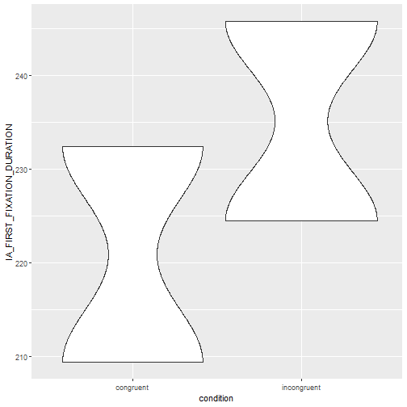
***
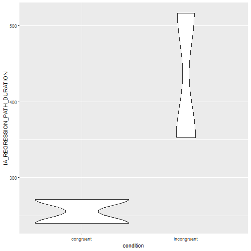


Visualizations in eye-tracking
========================================================

Many, many ways to do it!
- Maybe an advanced workshop on this?

Considerations
- What kind of analysis you're doing
- Which packages/softwares/shiny apps are available
- Visualizing data versus visualizing statistics


What does eye-tracking data look like?
========================================================

Here is another simulated dataset. Let's spend some time talking about how this one is different.
- What are all these columns?
- Which ones do I need?
- What could my research questions be?


Eye-tracking: Pros and cons
========================================================


**Advantages**
- High temporal resolution
- Non-invasive
- On-line measure of processing
- (Fairly) natural
- No other task needed

***

**Diasadvantages**
- Integrating with behavioural data
- Subjectivity of AOIs
- Operational definitions of fixations/saccades


Statistical analysis of eye-tracking data
========================================================
Here we can talk about mixed effects models


Hands-on work
========================================================

Pick one of the two datasets we discussed, and try answering one of the following questions with it

For Dataset A
- x
- y
- z

For Dataset B
- x
- z
- z


Links and other resources
========================================================


