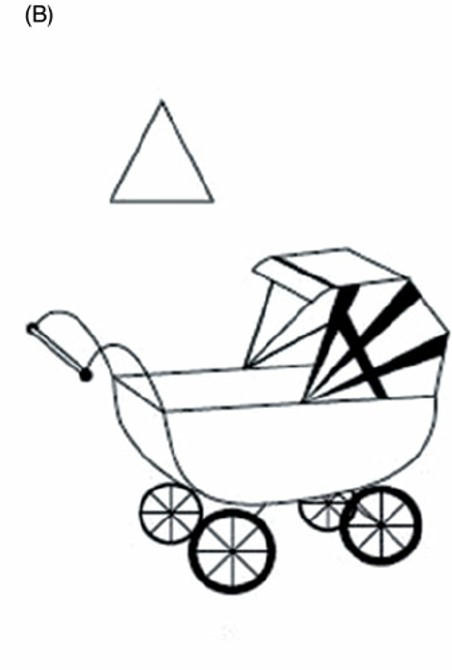
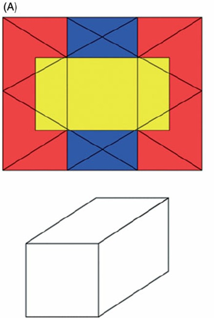
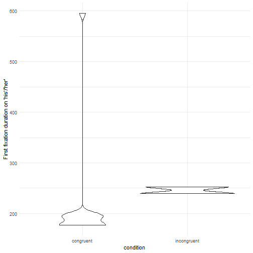
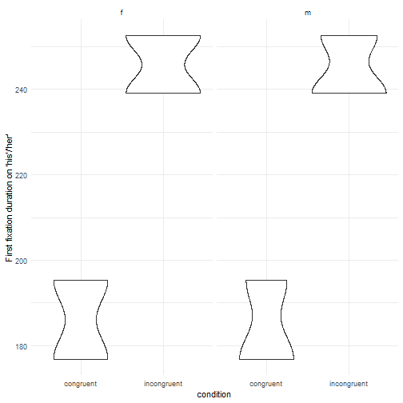

Eye-Tracking Workshop
========================================================
author: Julia and Divya
date: 02.09.2020
autosize: true
font-family: 'Lato'


The basic idea: What does eye-tracking do?
========================================================


Eye-tracking relies on the **eye-mind hypothesis/assumption**:  
What you look at is what you think about

And furthermore:  
Time is related to processing effort  
Delays hint at processing difficulties

Using eye-tracking, we can track participants' subconscious processes.  
It's an **on-line** (as opposed to off-line) measure of **processing difficulty** with a high temporal resolution.


The basic idea: What does eye-tracking do?
========================================================
type: prompt
incremental: true

Complete this sentence:  
*The old man...*

Now read this sentence:  
*The old man the boat.*

What happened when you read this sentence, and why?  
Which word(s) did you get stuck on?

Typically, people interpret *old* as an adjective which refers to *man* as a noun. But here, *old* is a noun and *man* a verb instead, so in **garden-path sentences** like these, readers need to update their interpretations. We'd typically see a delay on *the* because that's when readers realise their initial interpretation can't be correct.


How do eye-trackers work?
========================================================

They use a **camera** (left) and an **infrared light** (right)


***

...to track the **pupil** (green) and the **corneal reflection** (red)  
  


How do eye-trackers work?
========================================================
The difference between the **center of the pupil** and the **corneal reflection** is used to calculate the position of the gaze.
***


Eye-tracking systems
========================================================

**Three types of systems:**

- workstation/desktop
- mobile solutions
- eye-tracking glasses

***


Eye-tracking systems: Workstation/desktop
========================================================


Eye-tracking systems: Workstation/desktop
========================================================


Eye-tracking systems: Glasses
========================================================


Eye-tracking systems: Considerations
========================================================

**Practicality**
- desktop setups: participants have to travel to the lab
- mobile setups: can be done anywhere

**Naturalness**
- reading in a desktop setups is very different from how you would usually read
- mobile setups feel more natural

***

**Sampling rate**  
- measured in Hz (times per second)  
- = how many pictures the camera takes per second  
- from 25-30 Hz to 1000 Hz or more, depending on the device
- for reading experiments: at least 1000 Hz recommended
- desktop setups tend to have the highest sampling rate


Where can you use eye-tracking?
========================================================
**It's very versatile!**

- Reading (music), also in literary studies
- Cognitive tasks
- Free viewing, scene perception, visual search
- Communication between users and computer systems

***

**Applicability in**
- Linguistics
- Clinical psychology
- Consumer behaviour
- Expertise and training

...and for **many different kinds of participants**


Eye-tracking: Pros and cons
========================================================

**Advantages**
- High temporal resolution
- Non-invasive
- On-line measure of processing
- (Fairly) natural
- No other task needed

***

**Diasadvantages**
- Integrating with behavioural data
- Subjectivity of AOIs
- Operational definitions of fixations/saccades


Considerations: Experimental setup 
========================================================

- Calibration and validation [(video)](https://youtu.be/FPkRxzSE0bk?t=52)
- 'Trial'
- Checks:
  - question & feedback
  - drift correct/fixation between trials  

...while managing a long list of potential problems (contact lenses, glasses, mascara or long lashes, small eyes, wet eyes, downward-facing lashes, sunlight, electromagnetic noise in the lab...)


Typical eye-tracking procedure
========================================================

**Experimenter's view:**


...and an example of how our eyes move while we read [(video)](https://www.youtube.com/watch?v=j8-VYcYkgqY)


Task Examples
========================================================
**An example of a reading experiment investigating gender stereotypes**

Congruent condition:  
The *doctor* enjoyed *his* day off.  
The *nurse* liked *her* new shoes.  

Incongruent condition:  
The *doctor* enjoyed *her* day off.  
The *nurse* liked *his* new shoes.  

Here, we're interested in how people behave when they get to the pronouns *his* and *her*, so the areas/regions of interest (AOIs/IAs/ROIs) are those pronouns.  
<small>Often, the AOIs are determined by the design. There are, however, also procedures to find AOIs.</small>


Task Examples
========================================================
**The first free viewing experiment**


Task Examples
========================================================
**Embedded Figures Task**




Task Examples
========================================================
**Embedded Figures Task**




Let's look at some scan-paths
========================================================


What kind of data can you get from eye-trackers?
========================================================
type: prompt
incremental: true

- Fixations
- Saccades
- Microsaccades
- Regressions
- Pupil dilation
- Blinks  

What parameters could we get from these? How could they compliment each other?

Word of caution: These are not as categorical as may seem.


What does eye-tracking data look like?
========================================================

A distinction between 'Raw' and 'Event' data...

For the ease of data processing today, we will only use simulations of fixation data.


What does eye-tracking data look like?
========================================================

After exporting the event data, you'll typically be left with a lot of variables. For example, here are the column names of an exported data file from an EyeLink 1000 eye-tracker:
<div style="border: 1px solid #ddd; padding: 0px; overflow-y: scroll; height:500px; overflow-x: scroll; width:100%; "><table class=" lightable-paper" style='font-family: "Arial Narrow", arial, helvetica, sans-serif; margin-left: auto; margin-right: auto;'>
 <thead>
  <tr>
   <th style="text-align:left;position: sticky; top:0; background-color: #FFFFFF;"> x </th>
  </tr>
 </thead>
<tbody>
  <tr>
   <td style="text-align:left;"> RECORDING_SESSION_LABEL </td>
  </tr>
  <tr>
   <td style="text-align:left;"> TRIAL_INDEX </td>
  </tr>
  <tr>
   <td style="text-align:left;"> DATA_FILE </td>
  </tr>
  <tr>
   <td style="text-align:left;"> EYE_USED </td>
  </tr>
  <tr>
   <td style="text-align:left;"> IA_AREA </td>
  </tr>
  <tr>
   <td style="text-align:left;"> IA_AVERAGE_FIX_PUPIL_SIZE </td>
  </tr>
  <tr>
   <td style="text-align:left;"> IA_BOTTOM </td>
  </tr>
  <tr>
   <td style="text-align:left;"> IA_DWELL_TIME </td>
  </tr>
  <tr>
   <td style="text-align:left;"> IA_DWELL_TIME </td>
  </tr>
  <tr>
   <td style="text-align:left;"> IA_DYNAMIC </td>
  </tr>
  <tr>
   <td style="text-align:left;"> IA_END_TIME </td>
  </tr>
  <tr>
   <td style="text-align:left;"> IA_FIRST_FIXATION_DURATION </td>
  </tr>
  <tr>
   <td style="text-align:left;"> IA_FIRST_FIXATION_INDEX </td>
  </tr>
  <tr>
   <td style="text-align:left;"> IA_FIRST_FIXATION_RUN_INDEX </td>
  </tr>
  <tr>
   <td style="text-align:left;"> IA_FIRST_FIXATION_TIME </td>
  </tr>
  <tr>
   <td style="text-align:left;"> IA_FIRST_FIXATION_VISITED_IA_COUNT </td>
  </tr>
  <tr>
   <td style="text-align:left;"> IA_FIRST_FIXATION_X </td>
  </tr>
  <tr>
   <td style="text-align:left;"> IA_FIRST_FIXATION_Y </td>
  </tr>
  <tr>
   <td style="text-align:left;"> IA_FIRST_FIX_PROGRESSIVE </td>
  </tr>
  <tr>
   <td style="text-align:left;"> IA_FIRST_RUN_DWELL_TIME </td>
  </tr>
  <tr>
   <td style="text-align:left;"> IA_FIRST_RUN_END_TIME </td>
  </tr>
  <tr>
   <td style="text-align:left;"> IA_FIRST_RUN_FIXATION_COUNT </td>
  </tr>
  <tr>
   <td style="text-align:left;"> IA_FIRST_RUN_START_TIME </td>
  </tr>
  <tr>
   <td style="text-align:left;"> IA_FIRST_SACCADE_AMPLITUDE </td>
  </tr>
  <tr>
   <td style="text-align:left;"> IA_FIRST_SACCADE_ANGLE </td>
  </tr>
  <tr>
   <td style="text-align:left;"> IA_FIRST_SACCADE_END_TIME </td>
  </tr>
  <tr>
   <td style="text-align:left;"> IA_FIRST_SACCADE_INDEX </td>
  </tr>
  <tr>
   <td style="text-align:left;"> IA_FIRST_SACCADE_START_TIME </td>
  </tr>
  <tr>
   <td style="text-align:left;"> IA_FIXATION_COUNT </td>
  </tr>
  <tr>
   <td style="text-align:left;"> IA_FSA_COUNT_1 </td>
  </tr>
  <tr>
   <td style="text-align:left;"> IA_FSA_COUNT_2 </td>
  </tr>
  <tr>
   <td style="text-align:left;"> IA_FSA_COUNT_3 </td>
  </tr>
  <tr>
   <td style="text-align:left;"> IA_FSA_COUNT_4 </td>
  </tr>
  <tr>
   <td style="text-align:left;"> IA_FSA_COUNT_5 </td>
  </tr>
  <tr>
   <td style="text-align:left;"> IA_FSA_COUNT_6 </td>
  </tr>
  <tr>
   <td style="text-align:left;"> IA_FSA_COUNT_7 </td>
  </tr>
  <tr>
   <td style="text-align:left;"> IA_FSA_COUNT_8 </td>
  </tr>
  <tr>
   <td style="text-align:left;"> IA_FSA_COUNT_9 </td>
  </tr>
  <tr>
   <td style="text-align:left;"> IA_FSA_COUNT_10 </td>
  </tr>
  <tr>
   <td style="text-align:left;"> IA_FSA_COUNT_11 </td>
  </tr>
  <tr>
   <td style="text-align:left;"> IA_FSA_COUNT_12 </td>
  </tr>
  <tr>
   <td style="text-align:left;"> IA_FSA_COUNT_13 </td>
  </tr>
  <tr>
   <td style="text-align:left;"> IA_FSA_COUNT_14 </td>
  </tr>
  <tr>
   <td style="text-align:left;"> IA_FSA_COUNT_15 </td>
  </tr>
  <tr>
   <td style="text-align:left;"> IA_FSA_COUNT_16 </td>
  </tr>
  <tr>
   <td style="text-align:left;"> IA_FSA_COUNT_17 </td>
  </tr>
  <tr>
   <td style="text-align:left;"> IA_FSA_COUNT_18 </td>
  </tr>
  <tr>
   <td style="text-align:left;"> IA_FSA_COUNT_19 </td>
  </tr>
  <tr>
   <td style="text-align:left;"> IA_FSA_COUNT_20 </td>
  </tr>
  <tr>
   <td style="text-align:left;"> IA_FSA_COUNT_21 </td>
  </tr>
  <tr>
   <td style="text-align:left;"> IA_FSA_COUNT_22 </td>
  </tr>
  <tr>
   <td style="text-align:left;"> IA_FSA_COUNT_23 </td>
  </tr>
  <tr>
   <td style="text-align:left;"> IA_FSA_COUNT_24 </td>
  </tr>
  <tr>
   <td style="text-align:left;"> A_FSA_COUNT_25 </td>
  </tr>
  <tr>
   <td style="text-align:left;"> IA_FSA_COUNT_26 </td>
  </tr>
  <tr>
   <td style="text-align:left;"> IA_FSA_COUNT_27 </td>
  </tr>
  <tr>
   <td style="text-align:left;"> IA_FSA_COUNT_28 </td>
  </tr>
  <tr>
   <td style="text-align:left;"> IA_FSA_COUNT_29 </td>
  </tr>
  <tr>
   <td style="text-align:left;"> IA_FSA_COUNT_30 </td>
  </tr>
  <tr>
   <td style="text-align:left;"> IA_FSA_COUNT_31 </td>
  </tr>
  <tr>
   <td style="text-align:left;"> IA_FSA_COUNT_32 </td>
  </tr>
  <tr>
   <td style="text-align:left;"> IA_FSA_COUNT_33 </td>
  </tr>
  <tr>
   <td style="text-align:left;"> IA_FSA_COUNT_34 </td>
  </tr>
  <tr>
   <td style="text-align:left;"> IA_FSA_COUNT_36 </td>
  </tr>
  <tr>
   <td style="text-align:left;"> IA_FSA_COUNT_37 </td>
  </tr>
  <tr>
   <td style="text-align:left;"> IA_FSA_COUNT_38 </td>
  </tr>
  <tr>
   <td style="text-align:left;"> IA_FSA_COUNT_39 </td>
  </tr>
  <tr>
   <td style="text-align:left;"> IA_FSA_DURATION_1 </td>
  </tr>
  <tr>
   <td style="text-align:left;"> IA_FSA_DURATION_2 </td>
  </tr>
  <tr>
   <td style="text-align:left;"> IA_FSA_DURATION_3 </td>
  </tr>
  <tr>
   <td style="text-align:left;"> IA_FSA_DURATION_4 </td>
  </tr>
  <tr>
   <td style="text-align:left;"> IA_FSA_DURATION_5 </td>
  </tr>
  <tr>
   <td style="text-align:left;"> IA_FSA_DURATION_6 </td>
  </tr>
  <tr>
   <td style="text-align:left;"> IA_FSA_DURATION_7 </td>
  </tr>
  <tr>
   <td style="text-align:left;"> IA_FSA_DURATION_8 </td>
  </tr>
  <tr>
   <td style="text-align:left;"> IA_FSA_DURATION_9 </td>
  </tr>
  <tr>
   <td style="text-align:left;"> IA_FSA_DURATION_10 </td>
  </tr>
  <tr>
   <td style="text-align:left;"> IA_FSA_DURATION_11 </td>
  </tr>
  <tr>
   <td style="text-align:left;"> IA_FSA_DURATION_12 </td>
  </tr>
  <tr>
   <td style="text-align:left;"> IA_FSA_DURATION_13 </td>
  </tr>
  <tr>
   <td style="text-align:left;"> IA_FSA_DURATION_14 </td>
  </tr>
  <tr>
   <td style="text-align:left;"> IA_FSA_DURATION_15 </td>
  </tr>
  <tr>
   <td style="text-align:left;"> IA_FSA_DURATION_16 </td>
  </tr>
  <tr>
   <td style="text-align:left;"> IA_FSA_DURATION_17 </td>
  </tr>
  <tr>
   <td style="text-align:left;"> IA_FSA_DURATION_18 </td>
  </tr>
  <tr>
   <td style="text-align:left;"> IA_FSA_DURATION_19 </td>
  </tr>
  <tr>
   <td style="text-align:left;"> IA_FSA_DURATION_20 </td>
  </tr>
  <tr>
   <td style="text-align:left;"> IA_FSA_DURATION_21 </td>
  </tr>
  <tr>
   <td style="text-align:left;"> IA_FSA_DURATION_22 </td>
  </tr>
  <tr>
   <td style="text-align:left;"> IA_FSA_DURATION_23 </td>
  </tr>
  <tr>
   <td style="text-align:left;"> IA_FSA_DURATION_24 </td>
  </tr>
  <tr>
   <td style="text-align:left;"> IA_FSA_DURATION_25 </td>
  </tr>
  <tr>
   <td style="text-align:left;"> IA_FSA_DURATION_26 </td>
  </tr>
  <tr>
   <td style="text-align:left;"> IA_FSA_DURATION_27 </td>
  </tr>
  <tr>
   <td style="text-align:left;"> IA_FSA_DURATION_28 </td>
  </tr>
  <tr>
   <td style="text-align:left;"> IA_FSA_DURATION_29 </td>
  </tr>
  <tr>
   <td style="text-align:left;"> IA_FSA_DURATION_30 </td>
  </tr>
  <tr>
   <td style="text-align:left;"> IA_FSA_DURATION_31 </td>
  </tr>
  <tr>
   <td style="text-align:left;"> IA_FSA_DURATION_32 </td>
  </tr>
  <tr>
   <td style="text-align:left;"> IA_FSA_DURATION_33 </td>
  </tr>
  <tr>
   <td style="text-align:left;"> IA_FSA_DURATION_34 </td>
  </tr>
  <tr>
   <td style="text-align:left;"> IA_FSA_DURATION_35 </td>
  </tr>
  <tr>
   <td style="text-align:left;"> IA_FSA_DURATION_36 </td>
  </tr>
  <tr>
   <td style="text-align:left;"> IA_FSA_DURATION_37 </td>
  </tr>
  <tr>
   <td style="text-align:left;"> IA_FSA_DURATION_38 </td>
  </tr>
  <tr>
   <td style="text-align:left;"> IA_FSA_DURATION_39 </td>
  </tr>
  <tr>
   <td style="text-align:left;"> IA_GROUP </td>
  </tr>
  <tr>
   <td style="text-align:left;"> IA_ID </td>
  </tr>
  <tr>
   <td style="text-align:left;"> IA_INSTANCES_COUNT </td>
  </tr>
  <tr>
   <td style="text-align:left;"> IA_LABEL </td>
  </tr>
  <tr>
   <td style="text-align:left;"> IA_LAST_FIXATION_DURATION </td>
  </tr>
  <tr>
   <td style="text-align:left;"> IA_LAST_FIXATION_RUN </td>
  </tr>
  <tr>
   <td style="text-align:left;"> IA_LAST_FIXATION_TIME </td>
  </tr>
  <tr>
   <td style="text-align:left;"> IA_LAST_FIXATION_X </td>
  </tr>
  <tr>
   <td style="text-align:left;"> IA_LAST_FIXATION_Y </td>
  </tr>
  <tr>
   <td style="text-align:left;"> IA_LAST_RUN_DWELL_TIME </td>
  </tr>
  <tr>
   <td style="text-align:left;"> IA_LAST_RUN_END_TIME </td>
  </tr>
  <tr>
   <td style="text-align:left;"> IA_LAST_RUN_FIXATION </td>
  </tr>
  <tr>
   <td style="text-align:left;"> IA_LAST_RUN_FIXATION_COUNT </td>
  </tr>
  <tr>
   <td style="text-align:left;"> IA_LAST_RUN_START_TIME </td>
  </tr>
  <tr>
   <td style="text-align:left;"> IA_LAST_SACCADE_AMPLITUDE </td>
  </tr>
  <tr>
   <td style="text-align:left;"> IA_LAST_SACCADE_ANGLE </td>
  </tr>
  <tr>
   <td style="text-align:left;"> IA_LAST_SACCADE_END_TIME </td>
  </tr>
  <tr>
   <td style="text-align:left;"> IA_LAST_SACCADE_INDEX </td>
  </tr>
  <tr>
   <td style="text-align:left;"> IA_LAST_SACCADE_START_TIME </td>
  </tr>
  <tr>
   <td style="text-align:left;"> IA_LEFT </td>
  </tr>
  <tr>
   <td style="text-align:left;"> IA_LEGAL </td>
  </tr>
  <tr>
   <td style="text-align:left;"> IA_LEGAL_IMMEDIATE </td>
  </tr>
  <tr>
   <td style="text-align:left;"> IA_MAX_FIX_PUPIL_SIZE </td>
  </tr>
  <tr>
   <td style="text-align:left;"> IA_MIN_FIX_PUPIL_SIZE </td>
  </tr>
  <tr>
   <td style="text-align:left;"> IA_POINTS </td>
  </tr>
  <tr>
   <td style="text-align:left;"> IA_REGRESSION_IN </td>
  </tr>
  <tr>
   <td style="text-align:left;"> IA_REGRESSION_IN_COUNT </td>
  </tr>
  <tr>
   <td style="text-align:left;"> IA_REGRESSION_OUT </td>
  </tr>
  <tr>
   <td style="text-align:left;"> IA_REGRESSION_OUT_COUNT </td>
  </tr>
  <tr>
   <td style="text-align:left;"> IA_REGRESSION_OUT_FULL </td>
  </tr>
  <tr>
   <td style="text-align:left;"> IA_REGRESSION_OUT_FULL_COUNT </td>
  </tr>
  <tr>
   <td style="text-align:left;"> IA_REGRESSION_PATH_DURATION </td>
  </tr>
  <tr>
   <td style="text-align:left;"> IA_RIGHT </td>
  </tr>
  <tr>
   <td style="text-align:left;"> IA_RUN_COUNT </td>
  </tr>
  <tr>
   <td style="text-align:left;"> IA_SECOND_FIXATION_DURATION </td>
  </tr>
  <tr>
   <td style="text-align:left;"> IA_SECOND_FIXATION_RUN </td>
  </tr>
  <tr>
   <td style="text-align:left;"> IA_SECOND_FIXATION_TIME </td>
  </tr>
  <tr>
   <td style="text-align:left;"> IA_SECOND_FIXATION_X </td>
  </tr>
  <tr>
   <td style="text-align:left;"> IA_SECOND_FIXATION_Y </td>
  </tr>
  <tr>
   <td style="text-align:left;"> IA_SECOND_RUN_DWELL_TIME </td>
  </tr>
  <tr>
   <td style="text-align:left;"> IA_SECOND_RUN_END_TIME </td>
  </tr>
  <tr>
   <td style="text-align:left;"> IA_SECOND_RUN_FIXATION </td>
  </tr>
  <tr>
   <td style="text-align:left;"> IA_SECOND_RUN_FIXATION_COUNT </td>
  </tr>
  <tr>
   <td style="text-align:left;"> IA_SECOND_RUN_START_TIME </td>
  </tr>
  <tr>
   <td style="text-align:left;"> IA_SELECTIVE_REGRESSION_PATH_DURATION </td>
  </tr>
  <tr>
   <td style="text-align:left;"> IA_SKIP </td>
  </tr>
  <tr>
   <td style="text-align:left;"> IA_SPILLOVER </td>
  </tr>
  <tr>
   <td style="text-align:left;"> IA_START_TIME </td>
  </tr>
  <tr>
   <td style="text-align:left;"> IA_THIRD_FIXATION_DURATION </td>
  </tr>
  <tr>
   <td style="text-align:left;"> IA_THIRD_FIXATION_RUN </td>
  </tr>
  <tr>
   <td style="text-align:left;"> IA_THIRD_FIXATION_TIME </td>
  </tr>
  <tr>
   <td style="text-align:left;"> IA_THIRD_FIXATION_X </td>
  </tr>
  <tr>
   <td style="text-align:left;"> IA_THIRD_FIXATION_Y </td>
  </tr>
  <tr>
   <td style="text-align:left;"> IA_THIRD_RUN_DWELL_TIME </td>
  </tr>
  <tr>
   <td style="text-align:left;"> IA_THIRD_RUN_END_TIME </td>
  </tr>
  <tr>
   <td style="text-align:left;"> IA_THIRD_RUN_FIXATION </td>
  </tr>
  <tr>
   <td style="text-align:left;"> IA_THIRD_RUN_FIXATION_COUNT </td>
  </tr>
  <tr>
   <td style="text-align:left;"> IA_THIRD_RUN_START_TIME </td>
  </tr>
  <tr>
   <td style="text-align:left;"> IA_TOP </td>
  </tr>
  <tr>
   <td style="text-align:left;"> IA_TYPE </td>
  </tr>
  <tr>
   <td style="text-align:left;"> IP_END_EVENT_MATCHED </td>
  </tr>
  <tr>
   <td style="text-align:left;"> IP_END_TIME </td>
  </tr>
  <tr>
   <td style="text-align:left;"> IP_INDEX </td>
  </tr>
  <tr>
   <td style="text-align:left;"> IP_LABEL </td>
  </tr>
  <tr>
   <td style="text-align:left;"> IP_START_EVENT_MATCHED </td>
  </tr>
  <tr>
   <td style="text-align:left;"> IP_START_TIME </td>
  </tr>
  <tr>
   <td style="text-align:left;"> REPORTING_METHOD </td>
  </tr>
  <tr>
   <td style="text-align:left;"> TRIAL_DWELL_TIME </td>
  </tr>
  <tr>
   <td style="text-align:left;"> TRIAL_FIXATION_COUNT </td>
  </tr>
  <tr>
   <td style="text-align:left;"> TRIAL_IA_COUNT </td>
  </tr>
  <tr>
   <td style="text-align:left;"> TRIAL_LABEL </td>
  </tr>
  <tr>
   <td style="text-align:left;"> TRIAL_START_TIME </td>
  </tr>
  <tr>
   <td style="text-align:left;"> TRIAL_TOTAL_VISITED_IA_COUNT </td>
  </tr>
  <tr>
   <td style="text-align:left;"> ANSWER </td>
  </tr>
  <tr>
   <td style="text-align:left;"> CORRECTNESS </td>
  </tr>
  <tr>
   <td style="text-align:left;"> RT </td>
  </tr>
  <tr>
   <td style="text-align:left;"> RT_START </td>
  </tr>
  <tr>
   <td style="text-align:left;"> code </td>
  </tr>
  <tr>
   <td style="text-align:left;"> condition </td>
  </tr>
  <tr>
   <td style="text-align:left;"> correct_answer </td>
  </tr>
  <tr>
   <td style="text-align:left;"> ending </td>
  </tr>
  <tr>
   <td style="text-align:left;"> experiment </td>
  </tr>
  <tr>
   <td style="text-align:left;"> item_id </td>
  </tr>
  <tr>
   <td style="text-align:left;"> list </td>
  </tr>
  <tr>
   <td style="text-align:left;"> question </td>
  </tr>
  <tr>
   <td style="text-align:left;"> stimulus </td>
  </tr>
</tbody>
</table></div>


What does eye-tracking data look like?
========================================================

**Reading data**

Here is some simulated data from a reading experiment like the one on gender stereotypes explained on one of the previous slides:

<div style="border: 1px solid #ddd; padding: 0px; overflow-y: scroll; height:400px; overflow-x: scroll; width:100%; "><table class=" lightable-paper" style='font-family: "Arial Narrow", arial, helvetica, sans-serif; margin-left: auto; margin-right: auto;'>
 <thead>
  <tr>
   <th style="text-align:left;position: sticky; top:0; background-color: #FFFFFF;"> RECORDING_SESSION_LABEL </th>
   <th style="text-align:right;position: sticky; top:0; background-color: #FFFFFF;"> TRIAL_INDEX </th>
   <th style="text-align:left;position: sticky; top:0; background-color: #FFFFFF;"> DATA_FILE </th>
   <th style="text-align:left;position: sticky; top:0; background-color: #FFFFFF;"> EYE_USED </th>
   <th style="text-align:left;position: sticky; top:0; background-color: #FFFFFF;"> stimulus </th>
   <th style="text-align:left;position: sticky; top:0; background-color: #FFFFFF;"> condition </th>
   <th style="text-align:left;position: sticky; top:0; background-color: #FFFFFF;"> IA_LABEL </th>
   <th style="text-align:left;position: sticky; top:0; background-color: #FFFFFF;"> IA_FIRST_FIXATION_DURATION </th>
   <th style="text-align:right;position: sticky; top:0; background-color: #FFFFFF;"> TRIAL_FIXATION_COUNT </th>
   <th style="text-align:left;position: sticky; top:0; background-color: #FFFFFF;"> IA_REGRESSION_PATH_DURATION </th>
  </tr>
 </thead>
<tbody>
  <tr>
   <td style="text-align:left;"> p1 </td>
   <td style="text-align:right;"> 1 </td>
   <td style="text-align:left;"> p1.edf </td>
   <td style="text-align:left;"> RIGHT </td>
   <td style="text-align:left;"> The doctor enjoyed his day off. </td>
   <td style="text-align:left;"> congruent </td>
   <td style="text-align:left;"> the </td>
   <td style="text-align:left;"> . </td>
   <td style="text-align:right;"> 9 </td>
   <td style="text-align:left;"> . </td>
  </tr>
  <tr>
   <td style="text-align:left;"> p1 </td>
   <td style="text-align:right;"> 1 </td>
   <td style="text-align:left;"> p1.edf </td>
   <td style="text-align:left;"> RIGHT </td>
   <td style="text-align:left;"> The doctor enjoyed his day off. </td>
   <td style="text-align:left;"> congruent </td>
   <td style="text-align:left;"> doctor </td>
   <td style="text-align:left;"> 216.15628930369502 </td>
   <td style="text-align:right;"> 9 </td>
   <td style="text-align:left;"> . </td>
  </tr>
  <tr>
   <td style="text-align:left;"> p1 </td>
   <td style="text-align:right;"> 1 </td>
   <td style="text-align:left;"> p1.edf </td>
   <td style="text-align:left;"> RIGHT </td>
   <td style="text-align:left;"> The doctor enjoyed his day off. </td>
   <td style="text-align:left;"> congruent </td>
   <td style="text-align:left;"> enjoyed </td>
   <td style="text-align:left;"> . </td>
   <td style="text-align:right;"> 9 </td>
   <td style="text-align:left;"> . </td>
  </tr>
  <tr>
   <td style="text-align:left;"> p1 </td>
   <td style="text-align:right;"> 1 </td>
   <td style="text-align:left;"> p1.edf </td>
   <td style="text-align:left;"> RIGHT </td>
   <td style="text-align:left;"> The doctor enjoyed his day off. </td>
   <td style="text-align:left;"> congruent </td>
   <td style="text-align:left;"> his </td>
   <td style="text-align:left;"> 176.75659767559767 </td>
   <td style="text-align:right;"> 9 </td>
   <td style="text-align:left;"> 271.6653359294355 </td>
  </tr>
  <tr>
   <td style="text-align:left;"> p1 </td>
   <td style="text-align:right;"> 1 </td>
   <td style="text-align:left;"> p1.edf </td>
   <td style="text-align:left;"> RIGHT </td>
   <td style="text-align:left;"> The doctor enjoyed his day off. </td>
   <td style="text-align:left;"> congruent </td>
   <td style="text-align:left;"> day </td>
   <td style="text-align:left;"> . </td>
   <td style="text-align:right;"> 9 </td>
   <td style="text-align:left;"> . </td>
  </tr>
  <tr>
   <td style="text-align:left;"> p1 </td>
   <td style="text-align:right;"> 1 </td>
   <td style="text-align:left;"> p1.edf </td>
   <td style="text-align:left;"> RIGHT </td>
   <td style="text-align:left;"> The doctor enjoyed his day off. </td>
   <td style="text-align:left;"> congruent </td>
   <td style="text-align:left;"> off </td>
   <td style="text-align:left;"> 200.0483515328594 </td>
   <td style="text-align:right;"> 9 </td>
   <td style="text-align:left;"> 425.5284672916756 </td>
  </tr>
  <tr>
   <td style="text-align:left;"> p1 </td>
   <td style="text-align:right;"> 2 </td>
   <td style="text-align:left;"> p1.edf </td>
   <td style="text-align:left;"> RIGHT </td>
   <td style="text-align:left;"> The nurse liked his new shoes. </td>
   <td style="text-align:left;"> incongruent </td>
   <td style="text-align:left;"> the </td>
   <td style="text-align:left;"> . </td>
   <td style="text-align:right;"> 9 </td>
   <td style="text-align:left;"> . </td>
  </tr>
  <tr>
   <td style="text-align:left;"> p1 </td>
   <td style="text-align:right;"> 2 </td>
   <td style="text-align:left;"> p1.edf </td>
   <td style="text-align:left;"> RIGHT </td>
   <td style="text-align:left;"> The nurse liked his new shoes. </td>
   <td style="text-align:left;"> incongruent </td>
   <td style="text-align:left;"> nurse </td>
   <td style="text-align:left;"> . </td>
   <td style="text-align:right;"> 9 </td>
   <td style="text-align:left;"> . </td>
  </tr>
  <tr>
   <td style="text-align:left;"> p1 </td>
   <td style="text-align:right;"> 2 </td>
   <td style="text-align:left;"> p1.edf </td>
   <td style="text-align:left;"> RIGHT </td>
   <td style="text-align:left;"> The nurse liked his new shoes. </td>
   <td style="text-align:left;"> incongruent </td>
   <td style="text-align:left;"> liked </td>
   <td style="text-align:left;"> 221.73898569247328 </td>
   <td style="text-align:right;"> 9 </td>
   <td style="text-align:left;"> 413.7306506823907 </td>
  </tr>
  <tr>
   <td style="text-align:left;"> p1 </td>
   <td style="text-align:right;"> 2 </td>
   <td style="text-align:left;"> p1.edf </td>
   <td style="text-align:left;"> RIGHT </td>
   <td style="text-align:left;"> The nurse liked his new shoes. </td>
   <td style="text-align:left;"> incongruent </td>
   <td style="text-align:left;"> his </td>
   <td style="text-align:left;"> 239.04938991472204 </td>
   <td style="text-align:right;"> 9 </td>
   <td style="text-align:left;"> 352.9923965080749 </td>
  </tr>
  <tr>
   <td style="text-align:left;"> p1 </td>
   <td style="text-align:right;"> 2 </td>
   <td style="text-align:left;"> p1.edf </td>
   <td style="text-align:left;"> RIGHT </td>
   <td style="text-align:left;"> The nurse liked his new shoes. </td>
   <td style="text-align:left;"> incongruent </td>
   <td style="text-align:left;"> new </td>
   <td style="text-align:left;"> . </td>
   <td style="text-align:right;"> 9 </td>
   <td style="text-align:left;"> . </td>
  </tr>
  <tr>
   <td style="text-align:left;"> p1 </td>
   <td style="text-align:right;"> 2 </td>
   <td style="text-align:left;"> p1.edf </td>
   <td style="text-align:left;"> RIGHT </td>
   <td style="text-align:left;"> The nurse liked his new shoes. </td>
   <td style="text-align:left;"> incongruent </td>
   <td style="text-align:left;"> shoes </td>
   <td style="text-align:left;"> 188.63106235896998 </td>
   <td style="text-align:right;"> 9 </td>
   <td style="text-align:left;"> . </td>
  </tr>
  <tr>
   <td style="text-align:left;"> p2 </td>
   <td style="text-align:right;"> 1 </td>
   <td style="text-align:left;"> p2.edf </td>
   <td style="text-align:left;"> RIGHT </td>
   <td style="text-align:left;"> The doctor enjoyed her day off. </td>
   <td style="text-align:left;"> incongruent </td>
   <td style="text-align:left;"> the </td>
   <td style="text-align:left;"> . </td>
   <td style="text-align:right;"> 9 </td>
   <td style="text-align:left;"> . </td>
  </tr>
  <tr>
   <td style="text-align:left;"> p2 </td>
   <td style="text-align:right;"> 1 </td>
   <td style="text-align:left;"> p2.edf </td>
   <td style="text-align:left;"> RIGHT </td>
   <td style="text-align:left;"> The doctor enjoyed her day off. </td>
   <td style="text-align:left;"> incongruent </td>
   <td style="text-align:left;"> doctor </td>
   <td style="text-align:left;"> 246.69634028909056 </td>
   <td style="text-align:right;"> 9 </td>
   <td style="text-align:left;"> 539.8089207173703 </td>
  </tr>
  <tr>
   <td style="text-align:left;"> p2 </td>
   <td style="text-align:right;"> 1 </td>
   <td style="text-align:left;"> p2.edf </td>
   <td style="text-align:left;"> RIGHT </td>
   <td style="text-align:left;"> The doctor enjoyed her day off. </td>
   <td style="text-align:left;"> incongruent </td>
   <td style="text-align:left;"> enjoyed </td>
   <td style="text-align:left;"> 222.69941771678089 </td>
   <td style="text-align:right;"> 9 </td>
   <td style="text-align:left;"> . </td>
  </tr>
</tbody>
</table></div>


What does eye-tracking data look like?
========================================================

**Visual Search data**

Here is another simulated dataset. Let's spend some time talking about how this one is different.


```r
#VisualSearch_Sim <- read_csv("data/VIsualSearch_Sim.csv")
```


Working with eye-tracking data
========================================================

Pick one of the two datasets to work on.

- Read it in
- Prepare the data for visualisation (and statistical modeling)
- Come up with a visualisation (or two)
- Optional: Run a model on the data


Visualizations in eye-tracking
========================================================

Many, many ways to do it!
- Maybe an advanced workshop on this?

Considerations
- What kind of analysis you're doing
- Which packages/softwares/shiny apps are available
- Visualizing data versus visualizing statistics


Statistical analysis of eye-tracking data
========================================================
- Scan-path analysis
- Modeling
- Mixed effects
- Between group comparisons


Working with eye-tracking data
========================================================
type: prompt
incremental: true

**Reading data**

To prepare this data for visualisation and modeling, we could
- use 'select' to remove columns we don't need (e.g. EYE_USED, DATA_FILE)
- use 'filter' to
  - narrow down the data to the IAs we're curious about (*his* and *her*)
  - remove outliers
  - remove data points if the participants answered a question incorrectly
- convert to the correct data types
- use 'join' to add additional information such as word frequency or sociodemographic characteristics of the participants


Working with eye-tracking data
========================================================
type: prompt
incremental: true

**Visual Search**

- Explore the Data 
  - some pre-processing has already been done before simulating the data.
  Can you find out what that is?
- Find first fixation on Target word, after stimulus onset
- Find mean duration in Grid
- Are there any outliers? Remove them
- Find difference between first fixation on target/grid and end of trial
- Visualise the variables you created above


Working with eye-tracking data
========================================================


```r
reading_data <- read_csv("data/reading_example.csv", na = ".")
socio_data <- read_csv("data/sociodemographic_info.csv")

reading_reduced <- reading_data %>% 
  select(-c(EYE_USED, DATA_FILE)) %>% 
  filter(IA_LABEL %in% c("his", "her"))

reading <- left_join(reading_reduced, socio_data, by = c("RECORDING_SESSION_LABEL" = "participant"))
```


Working with eye-tracking data
========================================================
<div style="border: 1px solid #ddd; padding: 0px; overflow-y: scroll; height:700px; overflow-x: scroll; width:100%; "><table class=" lightable-paper" style='font-family: "Arial Narrow", arial, helvetica, sans-serif; margin-left: auto; margin-right: auto;'>
 <thead>
  <tr>
   <th style="text-align:left;position: sticky; top:0; background-color: #FFFFFF;"> RECORDING_SESSION_LABEL </th>
   <th style="text-align:right;position: sticky; top:0; background-color: #FFFFFF;"> TRIAL_INDEX </th>
   <th style="text-align:left;position: sticky; top:0; background-color: #FFFFFF;"> stimulus </th>
   <th style="text-align:left;position: sticky; top:0; background-color: #FFFFFF;"> condition </th>
   <th style="text-align:left;position: sticky; top:0; background-color: #FFFFFF;"> IA_LABEL </th>
   <th style="text-align:right;position: sticky; top:0; background-color: #FFFFFF;"> IA_FIRST_FIXATION_DURATION </th>
   <th style="text-align:right;position: sticky; top:0; background-color: #FFFFFF;"> TRIAL_FIXATION_COUNT </th>
   <th style="text-align:right;position: sticky; top:0; background-color: #FFFFFF;"> IA_REGRESSION_PATH_DURATION </th>
   <th style="text-align:left;position: sticky; top:0; background-color: #FFFFFF;"> gender </th>
   <th style="text-align:right;position: sticky; top:0; background-color: #FFFFFF;"> age </th>
  </tr>
 </thead>
<tbody>
  <tr>
   <td style="text-align:left;"> p1 </td>
   <td style="text-align:right;"> 1 </td>
   <td style="text-align:left;"> The doctor enjoyed his day off. </td>
   <td style="text-align:left;"> congruent </td>
   <td style="text-align:left;"> his </td>
   <td style="text-align:right;"> 176.7566 </td>
   <td style="text-align:right;"> 9 </td>
   <td style="text-align:right;"> 271.6653 </td>
   <td style="text-align:left;"> m </td>
   <td style="text-align:right;"> 26 </td>
  </tr>
  <tr>
   <td style="text-align:left;"> p1 </td>
   <td style="text-align:right;"> 2 </td>
   <td style="text-align:left;"> The nurse liked his new shoes. </td>
   <td style="text-align:left;"> incongruent </td>
   <td style="text-align:left;"> his </td>
   <td style="text-align:right;"> 239.0494 </td>
   <td style="text-align:right;"> 9 </td>
   <td style="text-align:right;"> 352.9924 </td>
   <td style="text-align:left;"> m </td>
   <td style="text-align:right;"> 26 </td>
  </tr>
  <tr>
   <td style="text-align:left;"> p2 </td>
   <td style="text-align:right;"> 1 </td>
   <td style="text-align:left;"> The doctor enjoyed her day off. </td>
   <td style="text-align:left;"> incongruent </td>
   <td style="text-align:left;"> her </td>
   <td style="text-align:right;"> NA </td>
   <td style="text-align:right;"> 9 </td>
   <td style="text-align:right;"> NA </td>
   <td style="text-align:left;"> m </td>
   <td style="text-align:right;"> 34 </td>
  </tr>
  <tr>
   <td style="text-align:left;"> p2 </td>
   <td style="text-align:right;"> 2 </td>
   <td style="text-align:left;"> The nurse liked her new shoes. </td>
   <td style="text-align:left;"> congruent </td>
   <td style="text-align:left;"> her </td>
   <td style="text-align:right;"> 595.3913 </td>
   <td style="text-align:right;"> 9 </td>
   <td style="text-align:right;"> 239.8634 </td>
   <td style="text-align:left;"> m </td>
   <td style="text-align:right;"> 34 </td>
  </tr>
  <tr>
   <td style="text-align:left;"> p3 </td>
   <td style="text-align:right;"> 1 </td>
   <td style="text-align:left;"> The doctor enjoyed his day off. </td>
   <td style="text-align:left;"> congruent </td>
   <td style="text-align:left;"> his </td>
   <td style="text-align:right;"> 176.7566 </td>
   <td style="text-align:right;"> 12 </td>
   <td style="text-align:right;"> 271.6653 </td>
   <td style="text-align:left;"> m </td>
   <td style="text-align:right;"> 30 </td>
  </tr>
  <tr>
   <td style="text-align:left;"> p3 </td>
   <td style="text-align:right;"> 2 </td>
   <td style="text-align:left;"> The nurse liked his new shoes. </td>
   <td style="text-align:left;"> incongruent </td>
   <td style="text-align:left;"> his </td>
   <td style="text-align:right;"> 239.0494 </td>
   <td style="text-align:right;"> 12 </td>
   <td style="text-align:right;"> 352.9924 </td>
   <td style="text-align:left;"> m </td>
   <td style="text-align:right;"> 30 </td>
  </tr>
  <tr>
   <td style="text-align:left;"> p4 </td>
   <td style="text-align:right;"> 1 </td>
   <td style="text-align:left;"> The doctor enjoyed her day off. </td>
   <td style="text-align:left;"> incongruent </td>
   <td style="text-align:left;"> her </td>
   <td style="text-align:right;"> 252.6243 </td>
   <td style="text-align:right;"> 12 </td>
   <td style="text-align:right;"> 516.5196 </td>
   <td style="text-align:left;"> m </td>
   <td style="text-align:right;"> 40 </td>
  </tr>
  <tr>
   <td style="text-align:left;"> p4 </td>
   <td style="text-align:right;"> 2 </td>
   <td style="text-align:left;"> The nurse liked her new shoes. </td>
   <td style="text-align:left;"> congruent </td>
   <td style="text-align:left;"> her </td>
   <td style="text-align:right;"> 195.3913 </td>
   <td style="text-align:right;"> 12 </td>
   <td style="text-align:right;"> 239.8634 </td>
   <td style="text-align:left;"> m </td>
   <td style="text-align:right;"> 40 </td>
  </tr>
  <tr>
   <td style="text-align:left;"> p5 </td>
   <td style="text-align:right;"> 1 </td>
   <td style="text-align:left;"> The doctor enjoyed his day off. </td>
   <td style="text-align:left;"> congruent </td>
   <td style="text-align:left;"> his </td>
   <td style="text-align:right;"> 176.7566 </td>
   <td style="text-align:right;"> 14 </td>
   <td style="text-align:right;"> 271.6653 </td>
   <td style="text-align:left;"> m </td>
   <td style="text-align:right;"> 32 </td>
  </tr>
  <tr>
   <td style="text-align:left;"> p5 </td>
   <td style="text-align:right;"> 2 </td>
   <td style="text-align:left;"> The nurse liked his new shoes. </td>
   <td style="text-align:left;"> incongruent </td>
   <td style="text-align:left;"> his </td>
   <td style="text-align:right;"> 239.0494 </td>
   <td style="text-align:right;"> 14 </td>
   <td style="text-align:right;"> 352.9924 </td>
   <td style="text-align:left;"> m </td>
   <td style="text-align:right;"> 32 </td>
  </tr>
  <tr>
   <td style="text-align:left;"> p6 </td>
   <td style="text-align:right;"> 1 </td>
   <td style="text-align:left;"> The doctor enjoyed her day off. </td>
   <td style="text-align:left;"> incongruent </td>
   <td style="text-align:left;"> her </td>
   <td style="text-align:right;"> 252.6243 </td>
   <td style="text-align:right;"> 14 </td>
   <td style="text-align:right;"> 516.5196 </td>
   <td style="text-align:left;"> m </td>
   <td style="text-align:right;"> 25 </td>
  </tr>
  <tr>
   <td style="text-align:left;"> p6 </td>
   <td style="text-align:right;"> 2 </td>
   <td style="text-align:left;"> The nurse liked her new shoes. </td>
   <td style="text-align:left;"> congruent </td>
   <td style="text-align:left;"> her </td>
   <td style="text-align:right;"> 195.3913 </td>
   <td style="text-align:right;"> 14 </td>
   <td style="text-align:right;"> 239.8634 </td>
   <td style="text-align:left;"> m </td>
   <td style="text-align:right;"> 25 </td>
  </tr>
  <tr>
   <td style="text-align:left;"> p7 </td>
   <td style="text-align:right;"> 1 </td>
   <td style="text-align:left;"> The doctor enjoyed his day off. </td>
   <td style="text-align:left;"> congruent </td>
   <td style="text-align:left;"> his </td>
   <td style="text-align:right;"> 176.7566 </td>
   <td style="text-align:right;"> 8 </td>
   <td style="text-align:right;"> 271.6653 </td>
   <td style="text-align:left;"> m </td>
   <td style="text-align:right;"> 33 </td>
  </tr>
  <tr>
   <td style="text-align:left;"> p7 </td>
   <td style="text-align:right;"> 2 </td>
   <td style="text-align:left;"> The nurse liked his new shoes. </td>
   <td style="text-align:left;"> incongruent </td>
   <td style="text-align:left;"> his </td>
   <td style="text-align:right;"> 239.0494 </td>
   <td style="text-align:right;"> 8 </td>
   <td style="text-align:right;"> 352.9924 </td>
   <td style="text-align:left;"> m </td>
   <td style="text-align:right;"> 33 </td>
  </tr>
  <tr>
   <td style="text-align:left;"> p8 </td>
   <td style="text-align:right;"> 1 </td>
   <td style="text-align:left;"> The doctor enjoyed her day off. </td>
   <td style="text-align:left;"> incongruent </td>
   <td style="text-align:left;"> her </td>
   <td style="text-align:right;"> 252.6243 </td>
   <td style="text-align:right;"> 8 </td>
   <td style="text-align:right;"> 516.5196 </td>
   <td style="text-align:left;"> m </td>
   <td style="text-align:right;"> 35 </td>
  </tr>
</tbody>
</table></div>


Visualizations in eye-tracking
========================================================


***


Visualizations in eye-tracking
========================================================
...without the outlier:  



Visualizations in eye-tracking
========================================================
...by gender:  



Interpretation/modeling
========================================================
type: prompt
incremental: true

- longer first fixations in incongruent conditions
- longer regressions in incongruent conditions
  - but: more variability
- interpretation: incongruent combinations (*doctor* + *she*, *nurse* + *he*) are more difficult to process


```r
fixations_mod <- lmer(IA_FIRST_FIXATION_DURATION ~ condition * gender + 
  (1 + condition * gender | RECORDING_SESSION_LABEL),
   data = reading)
regressions_mod <- lmer(IA_REGRESSION_PATH_DURATION ~ condition * gender + 
  (1 + condition * gender | RECORDING_SESSION_LABEL),
   data = reading)
```


Resources
========================================================

**Books**

- Conklin, K., Pellicer-Sanchez, A., & Carroll, G. (2018). *Eye-tracking: A guide for applied linguistics research*. Cambridge, New York, NY: Cambridge University Press.
- Klein, C., & Ettinger, U. (Eds.). (2019). *Eye Movement Research: An Introduction to Its Scientific Foundations and Applications*. Springer Nature.

***

**Links**
- https://sccn.ucsd.edu/~mgrivich/eyetracking.html
- https://imotions.com/blog/eye-tracking-work/
- https://www.researchgate.net/figure/Eye-tracking-workstation-mobile-eye-tracker-eye-tracking-glasses-Tobii-2014-SMI_fig20_311279776
- http://www.ifa.uni.wroc.pl/linguistics/?page_id=254
- https://www.mrn.org/collaborate/imaging-resources

