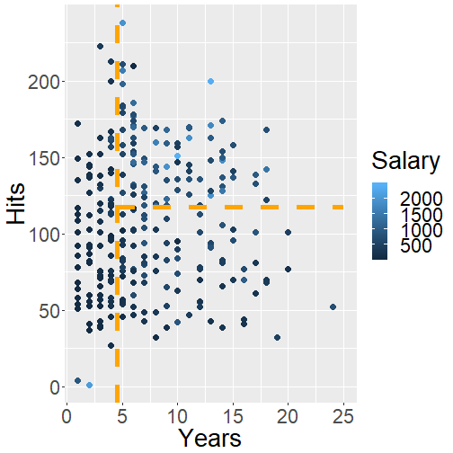

Modelling part 3 -
========================================================
autosize: true


# Machine Learning

## R-Ladies Freiburg

Elisa Schneider

Tree Based Methods
========================================================

<small> We use the **Hitters** data set to predict a baseball player's **Salary** based on

**Years**: the number of years that he has played in the major leagues and

**Hits**: the number of hits that he made in the previous year. </small>




Slide With Code
========================================================


```r
summary(cars)
```

```
     speed           dist       
 Min.   : 4.0   Min.   :  2.00  
 1st Qu.:12.0   1st Qu.: 26.00  
 Median :15.0   Median : 36.00  
 Mean   :15.4   Mean   : 42.98  
 3rd Qu.:19.0   3rd Qu.: 56.00  
 Max.   :25.0   Max.   :120.00  
```

Slide With Plot
========================================================


